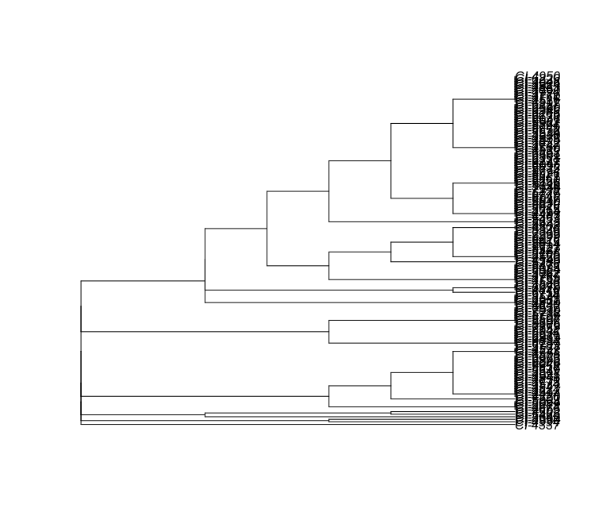
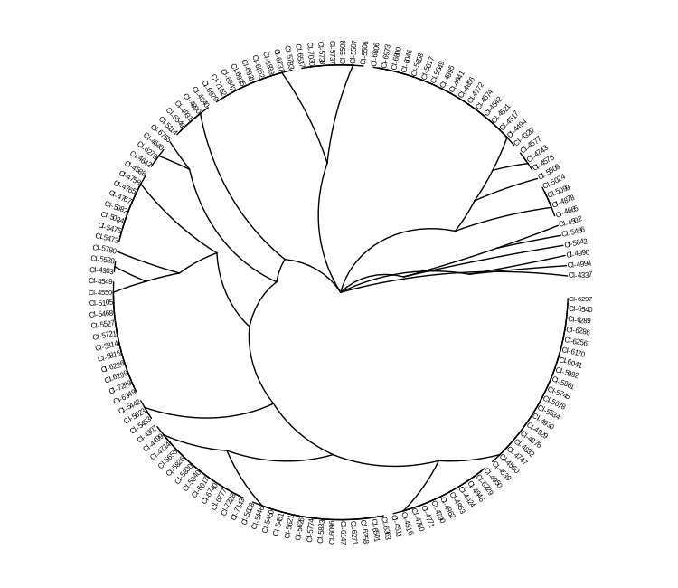
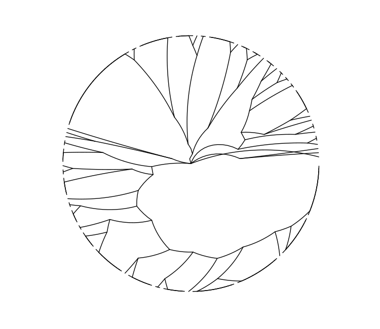
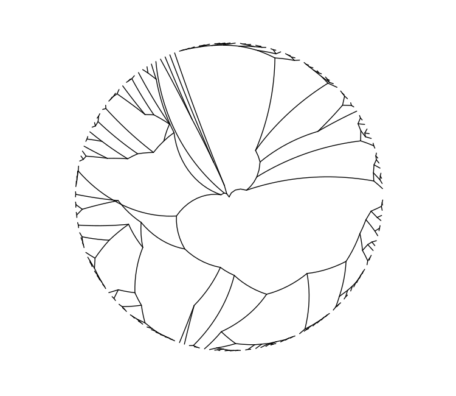
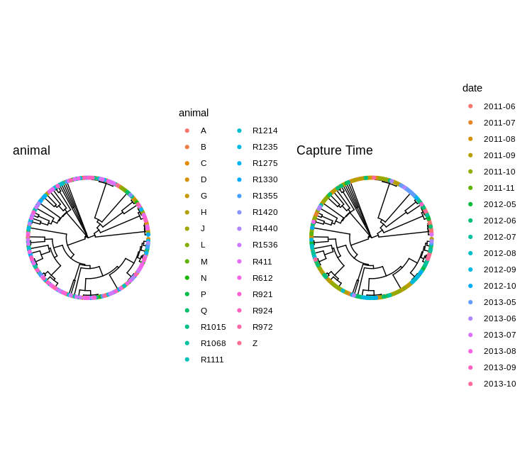
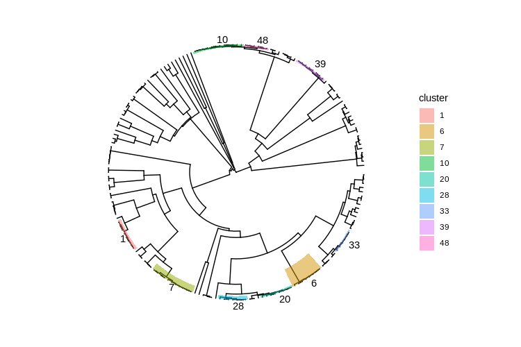

# Molecular Typing CBW Tutorial
## Dillon Barker - 2021-10-04

### Learning Objectives

Students will learn to: 

- Interpret genome-scale MLST results
- Compare allelic typing methods
- Visualize phylogenetic trees using R-lang and `ggtree`
- Clean noisy data
- Investigate an outbreak detected via routine surveillance

### Preamble

These exercises will take you through the process of analyzing surveillance data
for a foodborne bacterial pathogen. First you'll analyze the population using a
lower-resolution method, and then improve upon that with high-resolution core
genome multilocus sequence typing. The cgMLST call data will be noisy, and
you'll clean it to improve resolution and reliability. By projecting source and
temporal data on a phylogenetic tree, you'll identify an outbreak amongst the
sporadic cases in the surveillance data. Finally, you will further resolve the
outbreak using SNP typing.


Finally, if you finish an exercise early, I have included some bonus exercises.
These won't be covered in the tutorial and are not required to be done, but are
an elaboration upon material taught in the main exercise if you have spare time.

-----

We'll be looking at data derived from a surveillance program that isolated
_Campylobacter jejuni_ from wild raccoons. This raccoon population is being used
as a model system for _Campylobacter_ transmission in humans. Samples have been
taken from a population of wild raccoons, isolated, and sequenced on an Illumina
MiSeq. Your lab's bioinformatician has already taken care of assembling whole
genome sequences as well as  _in silico_ molecular typing including 7-gene
Multilocus Sequence Typing (MLST), and a 595-locus core genome multilocus
sequence typing scheme. You have been provided with these data, and you are to
analyze it for outbreak detection.

NB - This dataset really has been derived from a real-life raccoon surveillance 
program, however it has been modified to make it more amenable for teaching. 
Please feel free to ask me what modifications I've applied.  


### Exercise 0 - Setting Up

For this tutorial, we'll be using R interactively through RStudio, an integrated
development environment for the R Language.

You can connect to your CBW instance of RStudio Server via your favourite web
browser at:

```
<your.public.ip>:8080
```

You can get your machine's public IP address by running:

```bash
curl http://checkip.amazonaws.com
```

We will use an R Script file as a scratch pad for writing and running R code.

Create one by clicking on **File** → **New File** → **R Script**

You can type code into the R Script, and you can execute code by selecting it 
and **Ctrl+Enter**. Test that everything is working by loading the libraries
we'll be using for the rest of the tutorial and printing a message to yourself
in the console.

```r
library(ape)
library(ggtree)
library(treeio)
library(dplyr)
library(readr)
library(tidyr)
library(tibble)
library(aplot)
library(stringr)
library(ggplot2)

print("Hello, world!")
```

These libraries allow you to use pre-made code so you don't need to solve every
problem from scratch. For example, the `ape` library provides us with
`dist.gene`, a function that calculates pairwise allelic distances. Similarly,
`dplyr` gives us `select` and `filter` and many other functions for manipulating
tabular data.

### Exercise 1

We'll first try to tackle our raccoon population _C. jejuni_ surveillance data
using classic 7-gene MLST.

We will read a CSV file containing MLST allele calls, calculate pairwise
distances between these, cluster the distances, and generate a phylogenetic
tree.

```R
mlst_calls <- read_csv("mlst.csv", na="0")

mlst_calls  # run the variable name by itself to inspect the data

# the %>% operator passes the lefthand value to the righthand function, i.e.,
# x %>% f() %>% g() 
# is equivalent to
# g(f(x))

mlst_distances <- 
  mlst_calls %>% 
  column_to_rownames("genome") %>% 
  dist.gene(method = "pairwise", pairwise.deletion = FALSE)

mlst_clusters <- hclust(mlst_distances)

mlst_tree <- as.phylo(mlst_clusters)
```

Now that we have calculated a tree, we can plot it.

```R
plot(mlst_tree)
```



Unfortunately, this tree is ugly and hard to read. We can draw much nicer trees
using `ggtree`. We'll also read in a metadata file which contains auxiliary
information about our isolates.

```R
metadata <- read_csv("metadata.csv")

# We can use %<+% to attach a metadata file to a tree, and the + operator to add
# new layers to our plot

ggtree(mlst_tree, layout = "radial") %<+% metadata + 
  geom_tiplab(size = 2.0) 
  
```



Now our tree is much more aesthetically pleasing, but more crucially, easier to
read.

Is this tree _useful_, though? Can we learn much about the population structure
from it? How does our chosen typing method affect the tree?

#### Exercise 1 Bonus Work

Try manipulating some of the parameters to `ggtree()` or `geom_tiplab()` to
produce different visual results. You can view the documentation for these or
any other functions either by clicking on it and pressing `F1` on your keyboard,
or by typing it into the console with a leading `?`, e.g. `?ggtree`. In the docs
for `ggtree()`, there are some alternative tree layouts you can try.

If you have previous experience with `ggplot2`, many of the same concepts apply,
including the `aes()` function.

### Exercise 2

Your bioinformatician has also provided you with calls core genome multilocus
sequence typing scheme (cgMLST). It is structurally similar to classic MLST,
however, it uses a much larger number of loci. By having a larger number or
loci, more subtle differences between similar strains can be resolved.

Before we continue, we should remember that computers are supposed to make our
lives easier and not harder, and with a programming language like R, we can make
the computer do as we want. Let's write a small function that will let us easily
reuse the work we did for MLST, but on any similar data.

```R
calculate_tree <- function(calls, pairwise.deletion) {

  tree <-
    calls %>%
    column_to_rownames("genome") %>%
    dist.gene(method = "pairwise", pairwise.deletion = pairwise.deletion) %>%
    hclust() %>%
    as.phylo()

  tree
}
```

You can use your new function, `calculate_tree()` to quickly generate and draw a
tree for our cgMLST calls.

```R
raw_cgmlst_calls <- read_csv("cgmlst.csv", na="0")

raw_cgmlst_tree <- calculate_tree(raw_cgmlst_calls, pairwise.deletion = FALSE)

ggtree(raw_cgmlst_tree, layout = "radial")
```



This tree derived from cgMLST allele calls does not look particularly different
from the 7-gene MLST tree we drew earlier. What could be affecting this?

One problem that can affect any typing method — but MLST-like methods are
particularly sensitive to — is missing data. A locus can be absent because of
sequencing error or because that genomic region is not as conserved as was
believed. MLST-like methods assume that all loci are always present. In practice
due to the size of cgMLST schemes, some tolerance to missing data is required.

Generally, it is preferable to discard poor-quality genomes before removing loci
from the scheme. Here, we have encoded missing data as `0` in `cgmlst.csv`, and
told R to treat `0` as absent — `NA`.

Let's count the number of missing loci per genome.

```R
missing_per_genome <-
  raw_cgmlst_calls %>%
  rowwise(genome) %>%
  summarize(n_bad = sum(is.na(
    c_across(everything())
    ))
  ) %>%
  arrange(desc(n_bad))
```

Having calculated the number of missing calls per genome, we can preview the
sorted table, look at the summary statistics, and draw a histogram.

```R
missing_per_genome

summary(missing_per_genome$n_bad)

qplot(data=missing_per_genome, x=n_bad, geom="histogram", binwidth=1)
```

```
> missing_per_genome
# A tibble: 191 × 2
# Groups:   genome [191]
   genome  n_bad
   <chr>   <int>
 1 CI-5815   242
 2 CI-5603   234
 3 CI-5507   228
 4 CI-5626   227
 5 CI-4990   227
 6 CI-4542    13
 7 CI-4506    12
 8 CI-6226    12
 9 CI-4840    11
10 CI-4995    11
# … with 181 more rows

> summary(missing_per_genome$n_bad)
   Min. 1st Qu.  Median    Mean 3rd Qu.    Max. 
   1.00    5.00    6.00   11.99    8.00  242.00 
```


We can can see a normal-ish distribution of missing data around 10 loci per
genome, but there are a handful of troublemakers missing almost half of their
typing loci. Let's remember which ones they are so we can later remove them for
the greater good of our typing system.

```R
genomes_to_discard <-
  missing_per_genome %>%
  filter(n_bad > 200) %>%
  pull(genome)
```

We can also look to see if there are any misbehaving loci.

```R
missing_per_locus <-
  raw_cgmlst_calls %>%
  summarise(across(-genome, ~ sum(is.na(.)))) %>%
  pivot_longer(names_to = "locus",
               values_to = "n_bad",
               cols = everything()) %>%
  arrange(desc(n_bad))
```

We can summarize in a similar manner to the genomes:

```R
missing_per_locus

summary(missing_per_locus$n_bad)

qplot(data = missing_per_locus, x = n_bad, geom = "histogram", binwidth=1)
```
```
> missing_per_locus
# A tibble: 595 × 2
   locus       n_bad
   <chr>       <int>
 1 tktA           50
 2 purD           11
 3 group_12331    10
 4 rpmA           10
 5 korB            9
 6 ribA            9
 7 tmk             9
 8 ndhC            9
 9 dnaK            8
10 exoA            8
# … with 584 more rows

> summary(missing_per_locus$n_bad)
   Min. 1st Qu.  Median    Mean 3rd Qu.    Max. 
  0.000   3.000   4.000   3.857   5.000  50.000 
```


It looks like `tktA` is particularly troublesome in this population, and so we
decide to remove it from the analysis.

We can remove both genomes and locus in a single motion:

```R
filtered_cgmlst_calls <- 
  raw_cgmlst_calls %>%
  filter(!genome %in% genomes_to_discard) %>%
  select(-tktA)
```

When we calculate the tree, we can also tell `ape::dist.gene` to, on a pairwise
basis, not compare any two genomes at loci they don't share. This can be done by
setting `pairwise.deletion=TRUE`. If pairwise deletion is `FALSE`, then any
locus missing _any_ calls is dropped from the analysis. This can be an
acceptable compromise to make sure the remaining scattered missing loci do not
compromise the analysis.

```R
filtered_cgmlst_tree <- calculate_tree(filtered_cgmlst_calls,
                                       pairwise.deletion = TRUE)

ggtree(filtered_cgmlst_tree, layout="radial")
```



We can see greater discrimination between similar strains now that we have
cleaned our data. What would the relative merits have been to not removing
missing loci on a pairwise basis?

#### Exercise 2 Bonus

There is another locus which we may want to discard, albeit not because of
missing data. It has another problem. What is it?

### Exercise 3

To identify an outbreak within our surveillance data, we need to view the tree
in the context of the metadata. We have two variables to look at: the animal
from which the isolate was taken and the month when the animal was captured.

We can first save our basic tree visualization, and add metadata annotation to
it later.

```R
base_cgmlst_tree <- ggtree(filtered_cgmlst_tree, layout = "circular") 
```

First we will annotate the tree with information on the host animal.

```R
animal_tree <- 
  base_cgmlst_tree %<+%
  metadata +
  geom_tippoint(aes(colour = animal)) +
  labs(title = "animal")

animal_tree
```

When can draw a separate tree with the month of capture.

```R
time_tree <-
  base_cgmlst_tree %<+%
  metadata +
  geom_tippoint(aes(colour = date)) +
  labs(title = "Capture Time")
  
time_tree
```

We can also draw the two trees side-by-side to aid comparison.

```R
plot_list(animal_tree, time_tree,  ncol=2)
```



Can you spot the outbreak?

We can narrow the search by highlighting closely-related clusters with several
members.

```R
clusters <-
  filtered_cgmlst_tree %>% 
  as.hclust() %>% 
  cutree(h=10) %>% 
  as_tibble(rownames = "genome") %>% 
  rename(cluster = value)

bigger_clusters <-
  clusters %>% 
  group_by(cluster) %>% 
  summarize(n = length(genome)) %>% 
  filter(n >= 6) %>% 
  left_join(clusters) %>% 
  select(genome, cluster)

cluster_mrca_nodes <-
  bigger_clusters %>% 
  group_by(cluster) %>% 
  summarize(cluster_mrca = getMRCA(filtered_cgmlst_tree, genome)) %>% 
  mutate(cluster = factor(cluster))

cluster_labelled_tree <-  base_cgmlst_tree + 
  geom_highlight(data=cluster_mrca_nodes, 
                 mapping=aes(node = cluster_mrca,
                             fill = cluster)) +
  geom_cladelab(data=cluster_mrca_nodes,
                mapping=aes(node = cluster_mrca, 
                            label=cluster),
                size=10,
                barsize=0,
                offset=5)

cluster_labelled_tree
```



#### Exercise 3 Bonus

Look up the documentation for `gheatmap()` and see if you can use it as an
alternative method for drawing metadata on trees. Although the name implies
continuous variables, it can also show discrete variables such as the animal or
cluster data.

